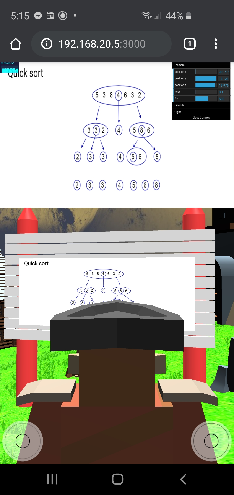
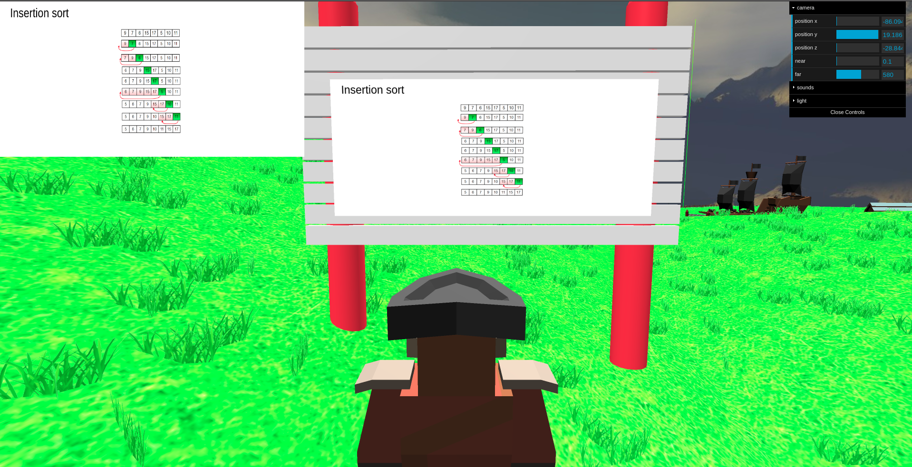

# Changelog

All notable changes to this project will be documented in this file.

The format is based on [Keep a Changelog](https://keepachangelog.com/en/1.0.0/)
and this project adheres to [Semantic Versioning](https://semver.org/spec/v2.0.0.html).

## [Unreleased]

### Changed

- World settings (e.g. landmark models, positions, ground color etc) have been moved out of construction classes and into individual setting interfaces.
  - This means that, if we wanted to change some world setting, all we need to do is modify the object in index.ts.
  - This is in preparation for creating a server and splitting client from server logic.
- Models are randomly chosen to act as landmarks from a wider selection.
- Skyboxes are randomly selected.
- Building geometry, number, and location are randomised.

### Fixed

- Skybox image naming are now consistent and file types are jpg.

## [0.4.0] Signpost Banners, Unit Tests, and Access Modifiers

### Added

- Added access modifiers to all class member variables and functions.
- Added unit tests for all World Helpers.
- No longer need to be in front of a signpost for it to light up and become interactable.
- Upon entering a signpost's viewing bounding box, the prompt is displayed in a banner along the top of the client.
  - In mobile, this banner is expected to span the entire width of the phone.
  - This is shown below:




## [0.3.0] Touch Controls & Merging Geometries Improvements

### Added

- Object clustering helpers can now merge the geometries of objects that require rotation before being placed on some plane.
- Touch controls have been overhauled:
  - Camera is now controlled via fresto32's fork of camera-controls.
    - This allows the user to rotate the camera via touch controls and to prevent its rotation when the user touches the touch joysticks.
  - User's can now 'interact' via touch controls.
  - Left joystick now allows 360 degree movement as opposed to the previous 4-directional mode.
  - The right joystick can also be used to rotate the camera.

### Fixed

- Gables on the -z side of buildings are now correctly mirrored. Previously, these gables were mirrored inwards instead of outwards.
- Avatar can no longer walk through fences.
- Collisions now force the avatar to move on a path that is normal to the colliding object's bounding box and the avatar. This prevents the avatar from merely backpeddling through objects.

## [0.2.0] Object Collision & Avatar Movement

### Added

- Avatar movement has been overhauled.
  - The avatar now moves relative to its current orientation.
  - Avatar can also strafe.
- The camera's [azimuth angle](https://en.wikipedia.org/wiki/Azimuth) is now locked onto the avatar's orientation.
- Object collision has been added.
  - When the avatar collides with a collidable object, the avatar's moves back.
  - Object clusters now generate bounding boxes for each object in the cluster for collision detection.
- ```Objects``` class now universally handles adding objects to containers.

## [0.1.0] Initial

### Added

- Undulating terrain.
- Signposts include pictures and prompt text.
- Landmarks at each signpost.
- Shrubbery across the terrain (rocks and grass tufts).
- Signpost interactions.
  - Signposts light up when avatar is in their vicinity.
  - Signposts light up green / red depending on whether they are the right answer or not.
  - The correct signpost emits fireworks on correct guess.
- Google's Typescript Style Guide enforcer.
  - Use ``` npx gts check ``` to run the check before commits.
  - Or, even better, integrate it into VS Code using Prettier.
- Avatar movement via:
  - wasd or arrow keys
  - left joystick control when on a touch device
- Camera control via:
  - mouse
  - right joystick control when on a touch device
- Camera is locked onto avatar.
- Map fencing and borders.
- Skybox.
- Geometry merging performance improvements: see: ```GenerateObjectCluster.ts```.
- Arbitrarily sized buildings.
  - Buildings can be constructed with an arbitrary number of height, depth, and width sections.
  - Buildings upper floors are hidden on avatar entry.
